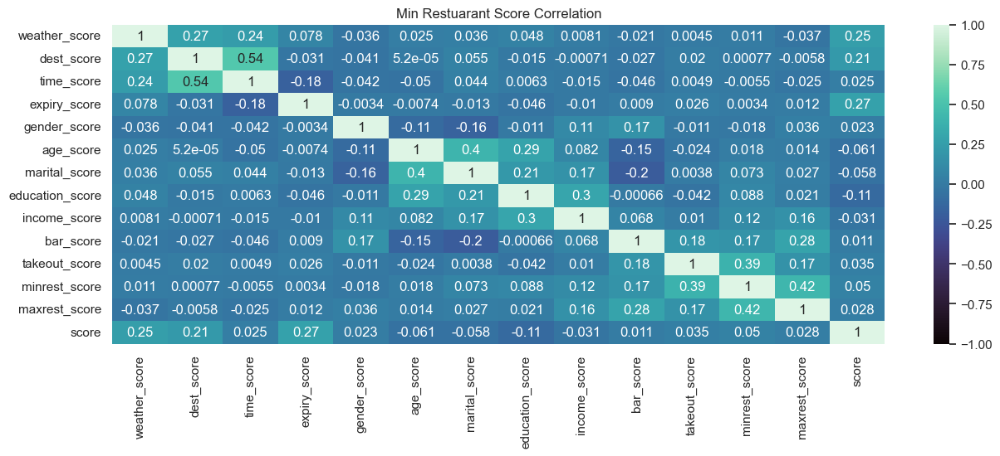
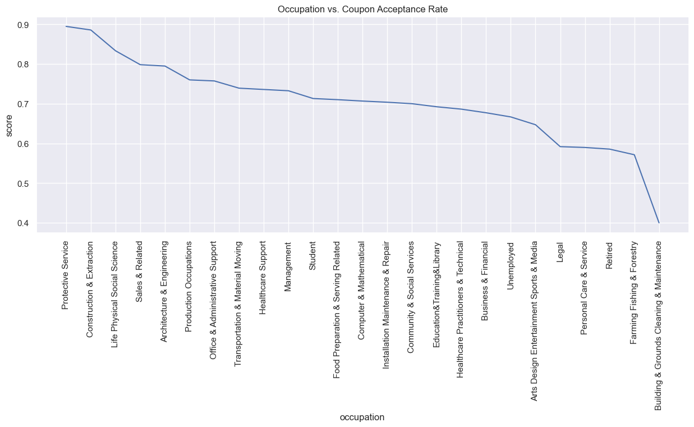
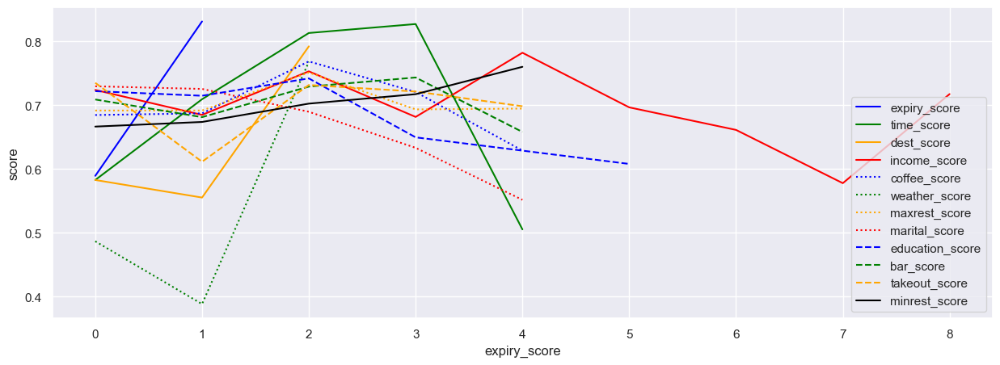
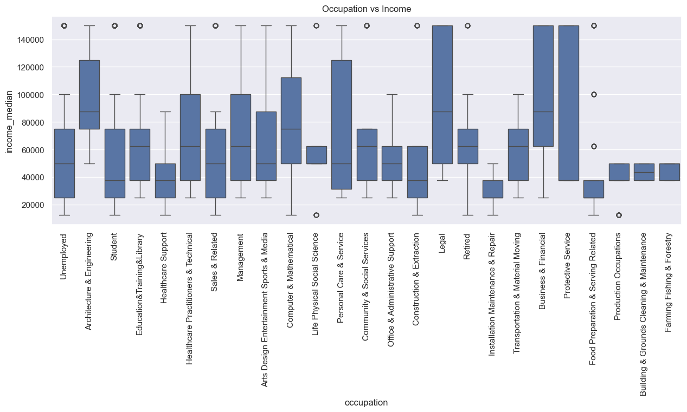

# Assignment 5.1: Will the Customer Accept the Coupon?
The final submission should create statistical summaries demonstrating differences in those who accepted and rejected the coupon. Ensure that your findings are clearly stated in a separate section alongside actionable items and recommendations.

## Project Files
The following files were used in this research:
* [assignment_5_1.ipynb](assignment_5_1.ipynb) - notebook for research
* [coupons.csv](data/coupons.csv) - provided data file

## Findings
I choose the inexpensive restaurants coupon(`Restaurant(<20)`). Overall, people accepted this coupon 71% of the time compared to the more expensive restaurant coupon, which was accepted 44% of the time. The following research illustrates what factors contributed to customers acceptance rate of the coupon. 

### Increasing the Coupon Acceptance Rate
As the overall acceptance rate is 71%, there are a number of categories that will increase the acceptance rate. A heatmap for these categories can be seen below.

In decreasing order, the following categories had acceptance rates higher than 75%:
* Coupon Expiration: 1 day. Longer coupons provide for more time to plan. 
* Time of Day: 6pm. At dinner time, people are hungry and more likely to accept a coupon for a dinner restaurant.
* Occupation: The occupations that had the highest acceptance rates are either physical jobs (police, construction), highly social (sales), or scientists
    * Protective Service - police, firefighters, security guards, and correctional officers
    * Construction & Extraction - boilermakers, carpenters, electricians, iron workers, masonry, hazmet, etc 
    * Life Physical Social Science - According to bureau of labor statistics this includes food sciencetists, archeologists, biologists, chemists, etc
    * Sales & Related - Sales people, retailers, and distributors
    * Architecture & Engineering - non-software related engineering disciplines (bio, ag, aerospace, chemical, civil, etc) 
* Destination: No Urgent Place. People who are heading to specific location are less likely (work or home)
* Income Score: $50-$60k. At this level of income, people have enough disposable income to afford a restaurant but are also budget conscious. 
* Coffee Score: 1-3 times a month. People who frequent coffee shops at this rate already 
* Weather Score: Sunny. Good weather increased acceptance rates, no matter the coupon. It generally puts people in good moods and increases their amenability
* Expensive Restaurant Score: 1-3 times a month. People who frequently eat out at expensive restaurants are also more likely to want to eat out at _any_ restaurant
* INexpensive Restaurant Score: more than 8 times a month. Unsurprisingly, this has a strong correlation to coupon acceptance rates.
Any two of the highest accepting categories (expiration, time, and occupation) will yield an acceptance rate in excess of 90%. Similarly, combining several of the remaining metrics will also yield an acceptance rate of 85-90%. There are a number of combinations which will yield 100 acceptance rates:
* Occupations, expiration, destination, and income
* Expiration, time, destination, income, and coffee
* Expiration, time, weather, expensive restaurant, and inexpensive restaurant

Occupation played a large part in coupon acceptance, the following chart shows the relationship between ones occupation and the acceptance rate for the coupon. 

The following chart shows _scores_ for each category - these are arbitrary numerical values assigned to each of the category values. These were charted to show which category values had the most impact on coupon acceptance rates. 

### Decreasing the Coupon Acceptance Rate
With a coupon acceptance rate of 71%, finding categories that significantly decrease the acceptance rate is much harder. The following groups had acceptance rates lower than 60%:
* Weather Score: Rainy. The flip-side of sunny weather, poor weather makes people less likely to want to go anywhere.
* Time of Day: 10pm. People who've already eaten dinner are less likely to accept a coupon for a lunch or dinner restaurant.
* Destination: Home. This could account for a number of situations (work is completed, heading back from a meal, etc).
* Occupation: The occupations that had the lowest acceptance rates are either low paying (farmers, janitorial, animal care) or ones with high ranges for income
    * Arts Design Entertainment Sports & Media - radio, television, movies, writers, etc
    * Legal - lawyers, paralegals, judges, arbitrators, etc
    * Personal Care & Service - animal care, childcare, funeral services, etc
    * Retired - residual or fixed income
    * Farming Fishing & Forestry - agricultural, logging, hunting, and fishing
    * Building & Grounds Cleaning & Maintenance - janitorial, grounds workers, and pest control
* Marital Score: Widowed. There are a number of reason why this category would be likely. 
With all categories having an acceptance rate of at least 50%, combining metrics increases the acceptance rate rather than lowering it. 

Looking at the occupations which _did not_ accept the coupon, it was largely occupations which had lower income, as seen below.

